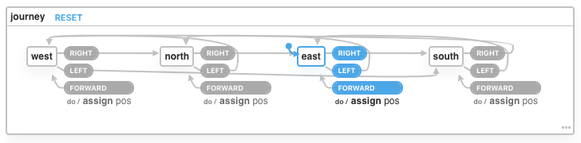

Journeys
========

Programming kata exercise with state machine ([xstate](https://xstate.js.org/)) running on nodejs. Please see https://github.com/mikehadlow/Journeys for more information.

Install
=======

```bash
git clone git@github.com:erhangundogan/journeys-state-machine.git
cd journeys-state-machine
npm i
node src
```

State-Machine
=============

Visualization by https://xstate.js.org/viz/ with [journeys state machine](src/helpers/state-machine.js). You can find online version [here](https://xstate.js.org/viz/?gist=076210cbd4d4d0c27784282800dbc181)




